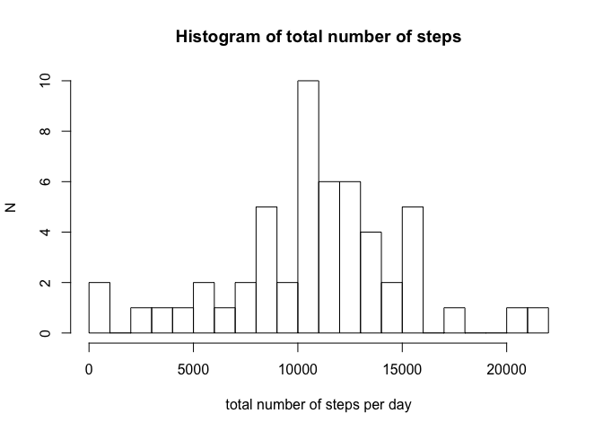
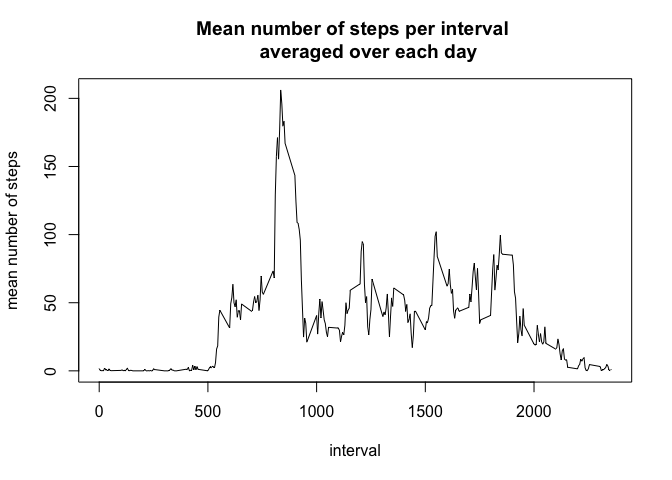
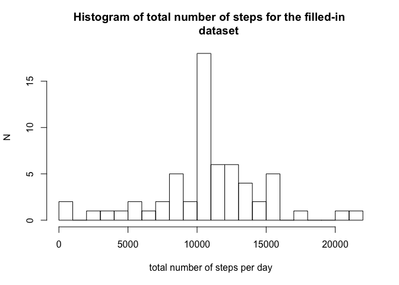
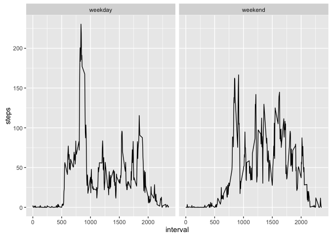

# Reproducible Research: Peer Assessment 1

##### 10-jul-2016

### Introduction

In this assignment, data from a motion-tracking device are analyzed. The dataset
represents the number of steps an individual has taken during each 5-min 
interval of the day. Data were obtained during a period of two months.


### Loading and preprocessing the data

The data are stored in a comma-separated .csv file, and can be read in with the
following line:


```r
data <- read.csv("activity.csv",header=TRUE,sep=",")
```

Transform the date column to the POSIXct format:


```r
data$date <- as.POSIXct(data$date)
```

Now, check the contents of dataset:

```r
str(data)
```

```
## 'data.frame':	17568 obs. of  3 variables:
##  $ steps   : int  NA NA NA NA NA NA NA NA NA NA ...
##  $ date    : POSIXct, format: "2012-10-01" "2012-10-01" ...
##  $ interval: int  0 5 10 15 20 25 30 35 40 45 ...
```

### What is mean total number of steps taken per day?

Calculate the total number of steps for each day; the function 'aggregate'
automatically removes missing (=NA) values:


```r
nsteps <- aggregate(steps ~ date, data, sum)
```

Make a histogram of the total number of steps taken each day:

```r
hist(nsteps$steps,breaks=20,xlab="total number of steps per day",ylab="N",
     main="Histogram of total number of steps")
```

<!-- -->

Calculate the mean of the total number of steps per day:

```r
nsteps_mean <- mean(nsteps$steps,na.rm=TRUE)
print(nsteps_mean)
```

```
## [1] 10766.19
```
Calculate the median of the total number of steps per day:

```r
nsteps_median <- median(nsteps$steps,na.rm=TRUE)
print(nsteps_median)
```

```
## [1] 10765
```

### What is the average daily activity pattern?

Calculate the mean number of steps per interval, averaged over all days

```r
nsteps_int <- aggregate(steps ~ interval,data,mean)
```

Make a time-series plot of the mean number of steps versus interval:

```r
plot(nsteps_int$interval,nsteps_int$steps,type="l",xlab="interval",
     ylab="mean number of steps",main="Mean number of steps per interval 
     averaged over each day")
```

<!-- -->

What is the interval where the mean number of steps is largest?

```r
nsteps_int$interval[which(nsteps_int$steps == max(nsteps_int$steps))]
```

```
## [1] 835
```

#### Imputing missing values

What is the total number of missing data values?

```r
sum(is.na(data$steps))
```

```
## [1] 2304
```

Fill in missing values in the steps column by substituing with the average for 
the corresponding interval:

```r
data_filled <- data
for (i in which(is.na(data$steps))) {
         interval_match <- which(nsteps_int$interval == data[i,3])
         data_filled[i,1] <- nsteps_int[interval_match,2]
}
```

Compute the total number of steps for each day, from filled-in dataset:

```r
nsteps_filled <- aggregate(steps ~ date, data_filled, sum)
```

Make a histogram of total number of steps each day using the filled-in dataset:

```r
hist(nsteps_filled$steps,breaks=20,xlab="total number of steps per day",
     ylab="N",main="Histogram of total number of steps for the filled-in 
     dataset")
```

<!-- -->

Compute the mean number of steps per day for the filled-in dataset:

```r
nsteps_filled_mean <- mean(nsteps_filled$steps,na.rm=TRUE)
print(nsteps_filled_mean)
```

```
## [1] 10766.19
```

Compute the median number of steps per day for the filled-in dataset:

```r
nsteps_filled_median <- median(nsteps_filled$steps,na.rm=TRUE)
print(nsteps_filled_median)
```

```
## [1] 10766.19
```

#### Are there differences in activity patterns between weekdays and weekends?

Create a new factor variable and add to the filled-in dataset

```r
day <- weekdays(data_filled[,2])
wk <- day
iweekend <- which(day == "Saturday" | day == "Sunday")
wk[iweekend] <- "weekend"
wk[which(wk != "weekend")] <- "weekday"
wk <- as.factor(wk)
data_filled_wk <- cbind(data_filled,wk)
```

Group the mean number of steps per weekday/weekendday and per interval:

```r
nsteps_filled_wk <- aggregate(steps ~ interval + wk,data_filled_wk,mean)
```

Make a time-series plot for the average number of steps for weekdays and weekends,
and plot them side by side:

```r
library(ggplot2)
```

```
## Warning: package 'ggplot2' was built under R version 3.2.4
```

```r
g <- ggplot(nsteps_filled_wk,aes(interval,steps))
g <- g + geom_line() + facet_grid(. ~ wk)
print(g)
```

<!-- -->


